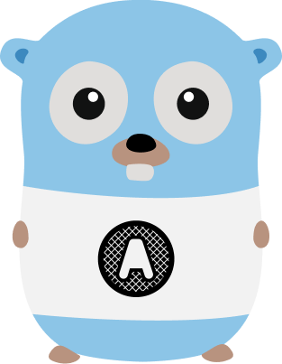
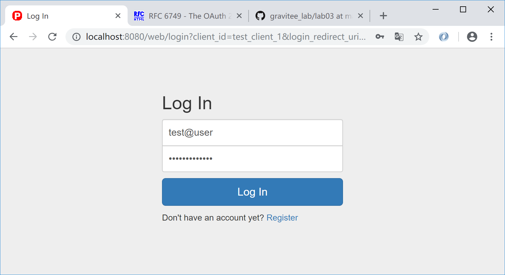
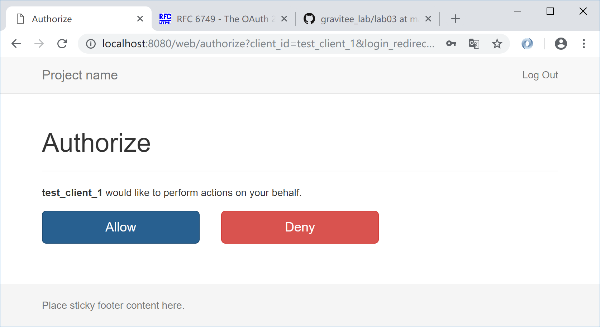
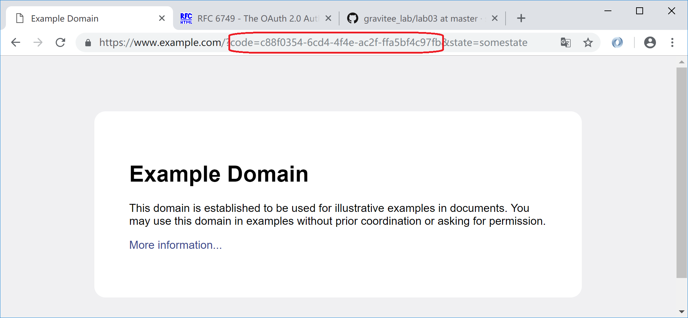
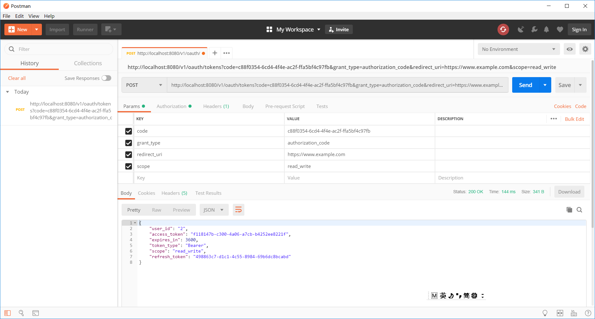
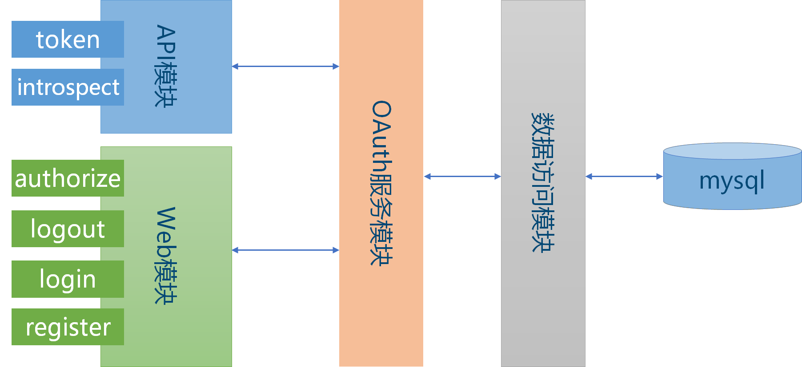
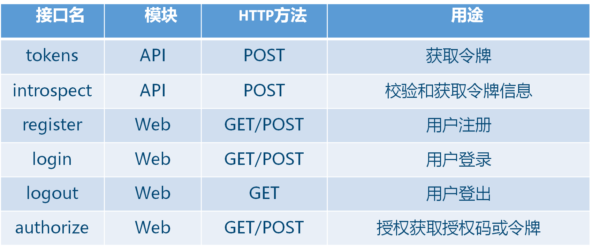
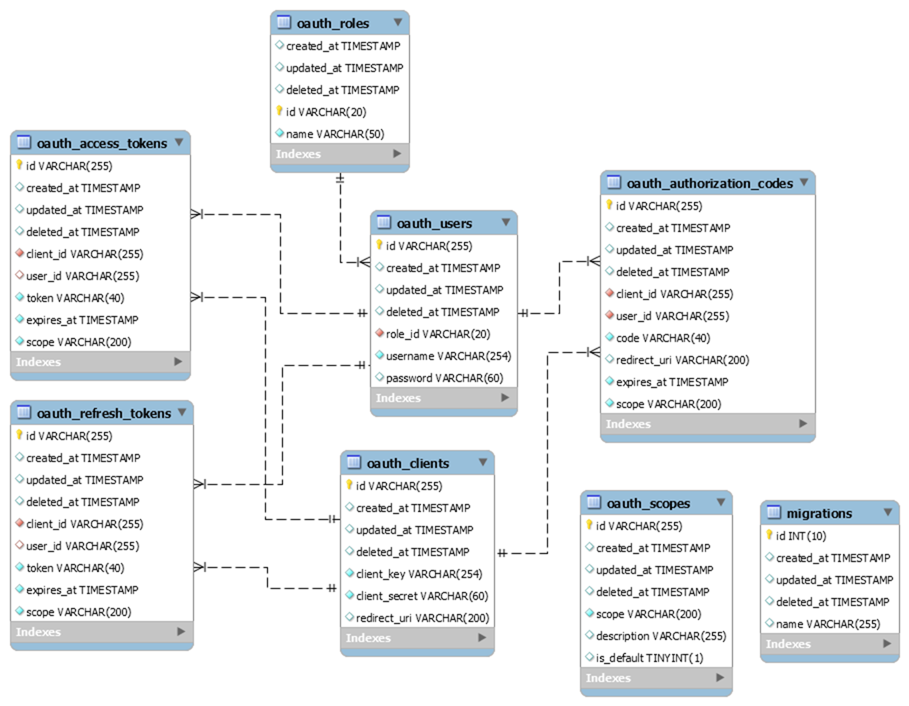

# Gravitee OAuth2简介



Go语言实现的轻量级OAuth2服务器，为极客时间课程《微服务架构和时间160讲》而开发。

自从我和极客时间合作的课程《微服务架构和实践160讲》上线以来，陆续收到一些学员的反馈，包括：

* Spring Cloud OAuth2复杂难以理解
* OAuth2的四个流程到底是如何实现的？
* 课程缺乏项目架构设计和实战开发案例
* 波波老师实践中是如何做架构设计的？

基于学员的上述反馈和疑问，同时考虑到OAuth2是微服务架构的重要环节，我决定带领大家分析一个轻量级OAuth2服务器(项目名Gravitee)的设计和实现，让大家深入理解OAuth2服务的原理和实现，同时解答大家的一些疑问。 

我这边的Gravitee项目会使用Golang语言实现，为啥使用Golang呢？原因如下：

1. Golang语言简单，语法简洁受控，适合课程讲解
2. Golang由Google公司开发支持，背书强大，社区生态好
3. Golang语言是云原生基础语言，近年社区热门的开源产品，例如k8s/docker/etcd/istio等，都是使用Golang语言开发
4. 微服务多语言(polygolot)开发的趋势，目前很多互联网公司会同时采用若干种语言开发业务和系统服务，互为补充
5. OAuth2本身实现和具体语言无关，理解了Golang版代码，不难用其它语言(如Java)实现

## **注意！！！**

1. 本项目代码仅为课程讲解开发，不是生产级！！！如需生产化，则还需要做很多生产扩展+严格的测试，具体见[项目扩展环节](#项目扩展环节)。同时，你若对本项目做了有价值生产扩展，欢迎提交pull requets。
2. 本项目源码主要参考[RichardKnop的go-oauth2-server](https://github.com/RichardKnop/go-oauth2-server)，感谢原作者！本项目对原项目主要做了如下修改：
* 数据库从Postgresql改为Mysql
* 配置简化为使用本地配置文件
* 依赖更新和使用[glide](https://github.com/Masterminds/glide)管理

## 安装启动起步

### 步骤一、下载源码并导入依赖

```
glide install
```

### 步骤二、构建服务器

```
go build gravitee-server.go
```

尝试运行服务器，看程序提示信息

```
./gravitee-server
```

程序主要支持**migate/loaddata/runserver**三个命令。**注意**，配置文件默认为服务器运行目录中的`config.yml`文件，如果配置文件在其它目录中，可以使用命令行参数`--configFile`指定。

### 步骤三、 创建数据库

安装mysql数据库，创建数据库，例如创建数据库名为`gravitee`，然后修改`config.yml`配置文件中的数据库连接信息，包括数据库名，用户名和密码等。

### 步骤四、创建表结构

运行

```
./gravitee-server migrate
```
校验数据库中users/clients/tokens等相关表格已经正确创建。**注意**，migrate动作只需在初始化时做一次。

### 步骤五、导入一些测试用种子数据

运行

```
./gravitee-server loaddata oauth/fixtures/scopes.yml oauth/fixtures/roles.yml oauth/fixtures/test_clients.yml oauth/fixtures/test_users.yml
```
查看users/clients/scopes/roles等表中已经有测试用种子数据

### 步骤六、运行oauth2服务器

运行

```
./gravitee-server runserver 
```

**注意**，服务器默认启动在8080端口，如需可在配置文件`config.yml`中修改，上述安装步骤可以同时参考[Gravitee Lab](https://github.com/spring2go/gravitee_lab)。

## OAuth2用例实操

下面以**授权码模式**为例展示如何使用Gravitee OAuth2服务(关于**授权码模式**的流程规范和请求参数的细节，请参考官方文档[OAuth2授权框架rfc6749的4.1节](https://tools.ietf.org/html/rfc6749#section-4.1))，假设Gravitee服务器已经启动，端口8080：

### 步骤一，浏览器授权请求

通过浏览器发起授权码请求：

```
http://localhost:8080/web/authorize?client_id=test_client_1&redirect_uri=https://www.example.com&response_type=code&state=somestate&scope=read_write
```

提示用户登录，可以采用种子用户数据(test@user/test_password)登录：



提示是否授权客户应用(test_client_1)代表用户去访问用户资源：



同意(Allow)授权，则重定向到客户应用指定的redirect_uri(此例是`www.example.com`)，同时会在查询字符串中给出授权码：



如果选择拒绝(Deny)，则会提示拒绝授权(access denied)错误。

### 步骤二，Postman请求令牌

通过Postman(或者curl命令行)模拟客户应用请求令牌，使用上面步骤获取的授权码：

```
curl -X POST --user test_client_1:test_secret http://localhost:8080/v1/oauth/tokens -d "code=c88f0354-6cd4-4f4e-ac2f-ffa5bf4c97fb&grant_type=authorization_code&redirect_uri=https://www.example.com&scope=read_write"
```

服务器返回访问令牌和刷新令牌：



获取令牌后，客户应用就可以使用该令牌访问用户资源。

### 其它用例

可以直接参考相应的[Gravitee Lab](https://github.com/spring2go/gravitee_lab)，或者参考波波的极客时间上的课程视频，其它用例包括：

* 简化模式
* 用户名密码模式
* 客户端模式
* 令牌校验
* 令牌刷新

## 架构和设计

### 总体架构和接口模型





Gravitee总体架构比较简单，使用**mysql**数据库做存储。数据库之上是**数据访问模块**，封装数据模型操作。中间层是**OAuth2服务模块**，这个是Gravitee核心，封装了OAuth2协议的四种核心流程逻辑。顶层有两个接口模块，一个是**API模块**，对外暴露获取令牌(tokens)和校验令牌(introspect)等端点；另外一个是**Web模块**，封装涉及Web交互的一些流程，如授权(authorize，授权码模式和简化模式使用)，用户注册(register)，登录认证(login)和登出(logout)等接口。

### 数据模型



Gravitee的数据模型也不复杂，核心概念是：

* oauth_clients，客户应用
* oauth_users，用户或资源拥有者

和三种tokens:

* oauth_access_tokens，访问令牌
* oauth_authorization_tokens，授权令牌(授权码)
* oauth_refresh_tokens，刷新令牌

相关概念和其中的字段本身不难理解，关系也很简单，客户和令牌之间是一对多关系，一个客户应用可以关联很多用户的令牌；用户和令牌之间也是一对多关系，即一个用户使用一个或多个不同应用(client)登陆后，会生成对应的授权码和访问令牌(或+刷新令牌)。

另外还有三个支持表，oauth_roles存储用户角色，oauth_scopes存储作用域相关信息，migrations表支持数据库升级。

## 源码简析

Gravitee的源码不多也不复杂，一般的中高级研发人员不难看懂。我这边再把主要的目录结构梳理一下，方便大家阅读理解源码，见下表：

主要目录和文件|简析
---------|---------
cmd      | 一些命令入口文件，如导入种子数据，数据库升级(包括第一次创建数据库表)和启动服务器
config   | 服务器配置相关支持类，配置有数据库配置、OAuth2服务配置和Session相关配置等
database | 负责建立和获取数据库连接的支持文件
health   | 暴露健康检查端点的服务
log      | 日志相关支持类
models   | 数据模型和ORM(使用[gorm](https://github.com/jinzhu/gorm))相关支持文件，OAuth2核心数据模型在这里
oauth    | 封装OAuth2的核心流程逻辑，并暴露服务接口和HTTP端点，这是最复杂的一个文件夹
public   | 静态css文件
services | 服务初始化和入口文件，类似一个service registry
session  | Web Session相关的服务封装支持类
test-util| 测试相关支持类
user     | 暴露用户创建端点的服务
util     | 项目中用到的工具类
vendor   | 第三方依赖包，由[glide](https://github.com/Masterminds/glide)依赖工具导入
web      | web模块的实现类，支持授权、注册、登录和登出的Web流程逻辑，同时依赖`OAuth2`和`Session`模块提供的服务
gravitee-server.go | 服务器程序主入口(main)，使用`cmd`目录内的命令执行具体任务。

程序的服务结构代码可以参考最简单的健康检查`health`模块(在health文件夹内)，其它的服务模块，如oauth/web/session/user等，都是采用类似的服务结构开发。在`web`模块中，为了支持登录授权，采用了[gorilla session](https://github.com/gorilla/sessions)做临时状态存储(暂使用客户端session)，也采用了golang http的middleware中间件拦截机制，这样登录授权流程才能穿起来，相关逻辑稍复杂，但是也不难看懂。

另外，本项目使用[glide](https://github.com/Masterminds/glide)做依赖管理，使用[vscode](https://code.visualstudio.com/)编辑和开发代码。

如果你对Golang还不太熟悉，可以参考[go by example](https://github.com/xg-wang/gobyexample)和[go cheat sheet](https://github.com/a8m/go-lang-cheat-sheet)快速上手。


## 项目扩展环节

**注意！！！**，本项目代码仅为课程讲解开发，不是生产级！！！如需生产化，则还需要做很多生产扩展+严格的测试，下面是一些可能的扩展点：

1. **支持令牌吊销(token revoke)端点**，根据某些业务场景(如用户设备丢失或者恶意用户)，可以吊销其令牌。
2. **支持jwt令牌**，本项目目前仅支持普通bearer令牌，采用授权服务器集中校验方式验令牌和获取用户信息，可以扩展支持jwt令牌，jwt是自包含令牌(可以包含用户和角色等信息)，且是自校验的(不需要集中校验)，可实现无状态认证。
3. **Client管理**，扩展对客户应用的管理和权限控制
4. **对接企业内部用户数据**，目前本项目自带用户模块，实际企业中可能已经有用户数据源，可以考虑和Gravitee服务集成对接。
5. **监控**，目前项目暂未实现监控埋点，如生产化前一定要做监控埋点，可以考虑和promethues监控平台对接，有golang客户端可以直接集成。
6. **集中式缓存**，目前令牌存mysql数据库，用户访问量不大时OK，如果量大则DB会成为瓶颈，特别是校验令牌操作会频繁发生，此时可以考虑使用内存数据库(如redis等)缓存令牌，加快校验速度。另外目前Web模块使用客户端Session，生产前建议扩展为集中式缓存Session。
7. **高可用**，Gravitee本身无状态，生产部署可以水平部署多个，分摊负载和防止单点。
8. **其它语言实现**，如果企业暂不能引入golang技术栈，则Gravitee本身很简单，在理解其设计实现的基础上，用其它语言(比如Java)实现并不难。


## 参考

《微服务架构实战160讲》


